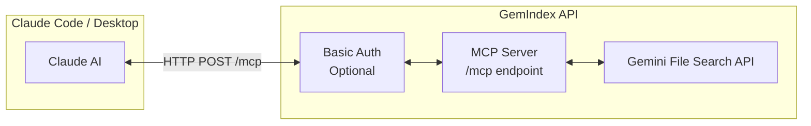
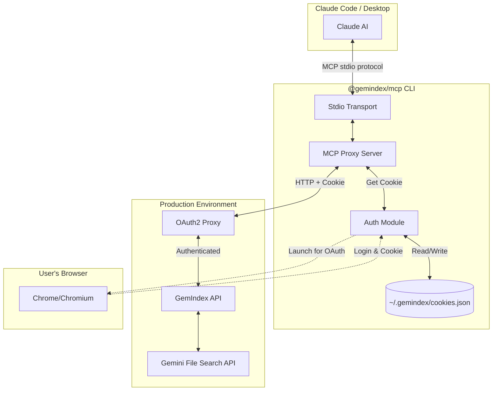
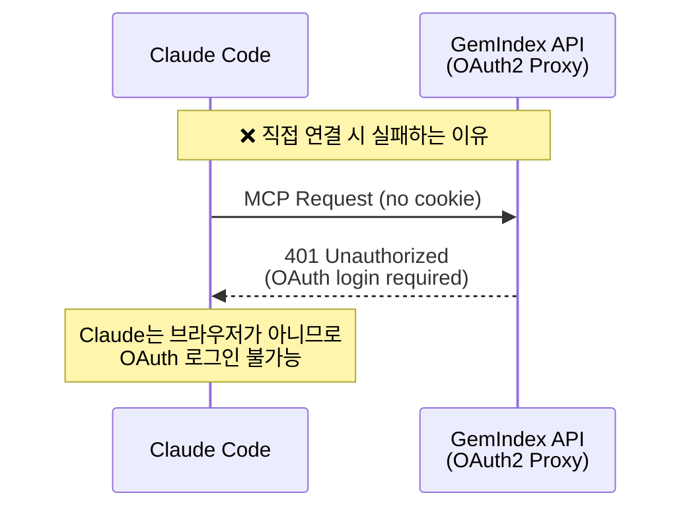
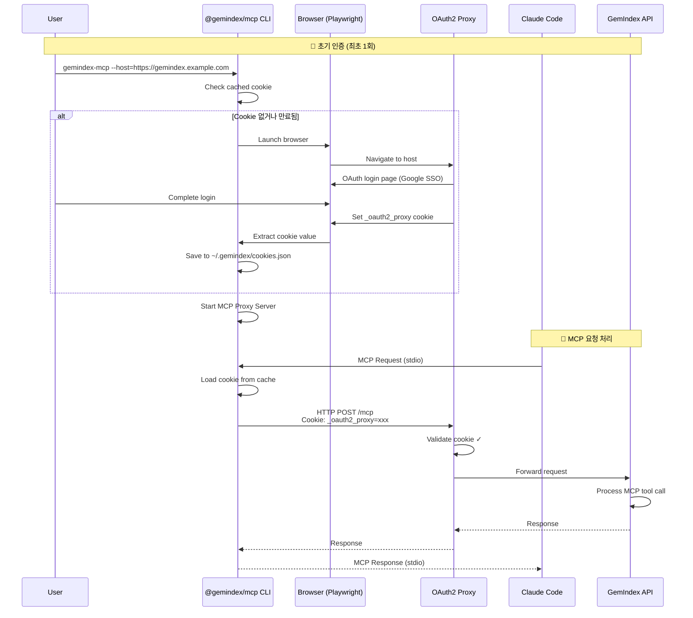

# GemIndex MCP Architecture

## 두 가지 배포 시나리오

GemIndex API는 **Remote MCP 서버**로 동작하며, 배포 환경에 따라 두 가지 방식으로 사용할 수 있습니다.

### 시나리오 1: Direct Remote MCP (OAuth2 Proxy 없음)

OAuth2 Proxy 없이 배포된 경우, Claude Code/Desktop에서 **직접 Remote MCP로 연결** 가능합니다.



**설정 예시:**

```json
{
  "mcpServers": {
    "gemindex": {
      "type": "url",
      "url": "https://gemindex.example.com/mcp"
    }
  }
}
```

---

### 시나리오 2: Stdio Proxy (OAuth2 Proxy 있음)

OAuth2 Proxy 뒤에 배포된 경우, `@gemindex/mcp` CLI가 **쿠키 인증을 자동 관리**합니다.

#### 문제 상황

- GemIndex API가 **OAuth2 Proxy** 뒤에 배포됨 (Google SSO 등)
- Claude MCP 클라이언트는:
  - OAuth2 리다이렉트를 처리할 수 없음
  - 브라우저 기반 로그인 플로우를 수행할 수 없음
  - `_oauth2_proxy` 쿠키를 자동으로 관리할 수 없음

#### 해결책

`@gemindex/mcp` CLI가 **브라우저로 OAuth 인증을 수행**하고, **쿠키를 추출하여 HTTP 요청에 자동 첨부**

---

## Stdio Proxy 상세 아키텍처

### 전체 구조



### OAuth2 Proxy 인증 문제



### Stdio Proxy 해결 방식



---

## 핵심 포인트 요약

| 시나리오              | 연결 방식                   | 인증                  |
| --------------------- | --------------------------- | --------------------- |
| **OAuth2 Proxy 없음** | Remote MCP (`type: url`)    | Basic Auth (Optional) |
| **OAuth2 Proxy 있음** | Stdio Proxy (`type: stdio`) | OAuth2 쿠키 자동 관리 |

### Stdio Proxy 컴포넌트

| 구성요소              | 역할                                       |
| --------------------- | ------------------------------------------ |
| **@gemindex/mcp CLI** | stdio ↔ HTTP 브릿지 + OAuth 쿠키 자동 관리 |
| **Playwright**        | 브라우저 자동화로 OAuth 로그인 수행        |
| **cookies.json**      | 인증 쿠키 로컬 캐시 (만료 관리)            |

---

## 사용 예시

### Direct Remote MCP (OAuth2 Proxy 없음)

```json
{
  "mcpServers": {
    "gemindex": {
      "type": "url",
      "url": "https://gemindex.example.com/mcp"
    }
  }
}
```

### Stdio Proxy (OAuth2 Proxy 있음)

```json
{
  "mcpServers": {
    "gemindex": {
      "type": "stdio",
      "command": "npx",
      "args": ["@gemindex/mcp", "--host=https://gemindex.example.com"]
    }
  }
}
```
